# Real-time Chat Application System Design

## Table of Contents

1. [Key Requirements & Assumptions](#key-requirements--assumptions)
   - 1.1 [Performance Calculations](#performance-calculations)
2. [Critical Design Decisions](#critical-design-decisions)
3. [System Architecture & APIs](#system-architecture--apis)
4. [WhatsApp-Style Message Flow](#whatsapp-style-message-flow-online-vs-offline-routing)
   - 4.1 [Simple Message Flow Overview](#simple-message-flow-overview)
   - 4.2 [Personal Chat Message Flow](#personal-chat-message-flow)
   - 4.3 [Group Chat Message Flow](#group-chat-message-flow)
   - 4.4 [Media Upload & Sharing Flow](#media-upload--sharing-flow)
5. [End-to-End Encryption Architecture](#end-to-end-encryption-architecture)
   - 5.1 [Signal Protocol Implementation](#signal-protocol-implementation)
   - 5.2 [Key Exchange & Distribution](#key-exchange--distribution)
   - 5.3 [Group Key Management](#group-key-management)
6. [Discussion Points](#discussion-points)

## 1. Key Requirements & Assumptions

### Core Chat Features (Focus: 1-on-1 End-to-End Chat)
- **Direct messaging**: low latency delivery between two (online) users
- **End-to-end encryption**: Zero server knowledge, client-side key management, forward secrecy
- **Ephemeral messaging**: Messages auto-delete after delivery confirmation (WhatsApp-like)
- **Presence & indicators**: Online status, read receipts
- **Media sharing**: Encrypted files with ephemeral storage
- **Group chats**: Basic multi-user support (secondary priority)

### Chat Types
- **Direct Messages (Primary Focus)**: 1-on-1 private conversations with E2E encryption
- **Group Chats (Secondary)**: Multi-user conversations with shared encryption keys

### Performance Targets
- **Scale**: 10K → 100K concurrent users (primarily 1-on-1 conversations)
- **Throughput**: 10K messages/second
- **Latency**: <100ms direct message delivery, <50ms typing indicators
- **E2E Encryption**: <10ms encryption overhead per message

### 1.1 Performance Calculations

**Connection Capacity Analysis:**

Go Goroutine Memory:
- Base goroutine stack: 2KB
- WebSocket connection overhead: ~4KB (buffers, state)
- Total per connection: ~6KB

Server capacity (16GB RAM, 50% for connections):
```
8GB available ÷ 6KB per connection = 1.4M theoretical max
```

Erlang/Elixir comparison:
```
400 bytes per process × 2M processes = 800MB
Same 8GB server: 8GB ÷ 400 bytes = 20M processes
WhatsApp proved 2M+ on single server
```

**Latency Breakdown (Target <100ms):**

Message delivery path:
```
Client → WebSocket Gateway: 5ms (local network)
Gateway → Message Service: 10ms (gRPC internal)
Message Service processing: 5ms (memory ops)
Message Service → Recipient Gateway: 10ms (gRPC)
Gateway → Recipient Client: 5ms (WebSocket)
Delivery confirmation return: 15ms (same path back)
Total: ~50ms one-way, ~100ms round-trip with confirmation
```

Database query times:
```
INSERT message: 2-5ms (indexed table)
SELECT online status: 1ms (Redis cache)
UPDATE message status: 2ms (indexed update)
```

**Throughput Calculations:**

10K messages/second target:
```
Per-message processing: 5ms
Worker capacity: 1000ms ÷ 5ms = 200 msg/sec per worker
Required workers: 10,000 msg/sec ÷ 200 = 50 workers total
With 4 Message Service instances: 50 ÷ 4 = ~12 workers each
```

Database capacity:
```
PostgreSQL on SSD: ~5K writes/sec per core
4-core instance: ~20K writes/sec theoretical
Message + status updates = 2 writes per message
Effective: 10K messages/sec (matches target)
```

### Key Assumptions
- **Business**: E2E encryption non-negotiable, WhatsApp-like experience

## 2. Critical Design Decisions

### 1. Programming Language Choice

**Key Options:**
- **Erlang/Elixir**: 2M+ connections (WhatsApp), 400 bytes/process, built for telecom
- **Go**: 10K-50K connections, 2KB/goroutine, good balance of performance/simplicity  
- **Node.js**: 1K-10K connections, 10KB+/connection, huge ecosystem but single-threaded
- **Rust**: 100K+ connections, 1KB/connection, zero-cost but steep learning curve

**Decision: Go**
- Handles 10K concurrent connections efficiently within timeline constraints
- Team expertise available, reasonable learning curve
- Good ecosystem for WebSocket/real-time applications

**Second option: Erlang**
- Amazing for concurrency
- Fault tolerance
- Proven for handling Whatsapp load

### 2. Architecture Pattern

**Key Options:**
- **Microservices**: Independent scaling, fault isolation, operational complexity
- **Monolithic**: Simple deployment, technology lock-in, scaling limitations  
- **Serverless**: Auto-scaling, but cold start kills real-time performance

**Decision: Microservices**  
- **Independent Scaling**: WebSocket gateways scale based on connection count, message services scale on message volume, media services scale on upload/download traffic
- **Fault Isolation**: Critical for 1-on-1 E2E encrypted conversations - one service failure doesn't break entire chat functionality
- **Technology Diversity**: Different services can use optimal tech stacks (Go for WebSocket gateways, Node.js for real-time features, Python for ML/media processing)
- **Resource Optimization**: Each service can be optimized for its specific workload (memory-intensive for WebSocket connections, CPU-intensive for encryption)
- **Performance Tuning**: Each service can be tuned independently (connection pooling for DB services, caching strategies per service)
- **Cost Efficiency**: Scale only the services that need scaling, rather than entire monolith

### 3. Database Choice

**Key Options:**
- **PostgreSQL**: ACID guarantees, message ordering consistency, complex horizontal scaling
- **MongoDB**: Flexible schema, horizontal scaling, eventual consistency issues
- **Cassandra**: High write throughput, time-series natural, message ordering problems

**Decision: PostgreSQL (Server) + SQLite (Client)**
- **Server**: Message ordering consistency critical for 1-on-1 conversations
- **Server**: ACID guarantees prevent race conditions in direct messaging
- **Server**: Reliable storage with Kafka-based ephemeral message cleanup
- **Client**: SQLite stores decrypted chat history locally (server can't decrypt)
- **Client**: Local backup enables offline reading and message search

### 4. Real-time Communication

**Key Options:**
- **WebSockets**: Full bidirectional, stateful connections, complex load balancing
- **Server-Sent Events**: Simpler, HTTP/2 friendly, but unidirectional
- **Long Polling**: Universal compatibility, but inefficient at scale

**Decision: WebSockets**
- Bidirectional communication essential for 1-on-1 typing indicators
- Lower latency critical for end-to-end encrypted real-time messaging

## 3. System Architecture & APIs

### Core Components


### Key APIs
**REST Endpoints (Legacy/External APIs):**
```
POST   /messages                    # Send message (used by WebSocket Gateway)
PUT    /messages/{messageId}/delivered  # Update message delivery status
PUT    /messages/{messageId}/received   # Update message received status  
PUT    /messages/{messageId}/read       # Update message read status
POST   /upload/request              # Get presigned upload URL
```

**WebSocket Events:** `wss://ws.chatapp.com/v1/chat?token=jwt`

```json
// Send direct message (E2E encrypted, ephemeral)
{"type": "message.send", "data": {"recipient_id": "user_456", "encrypted_content": "...", "encrypted_key": "...", "ephemeral": true}}

// Message delivery confirmation (triggers auto-delete)
{"type": "message_delivered", "data": {"message_id": "msg_789", "recipient_id": "user_456"}}

// Message sent acknowledgment (final deletion trigger) 
{"type": "message_sent", "data": {"message_id": "msg_789", "sender_id": "user_456"}}

// Typing indicator for 1-on-1
{"type": "typing_start", "data": {"recipient_id": "user_456"}}

// Read receipt
{"type": "message_read", "data": {"message_id": "msg_789", "sender_id": "user_456"}}
```

## 4. WhatsApp-Style Message Flow: Online vs Offline Routing

### 4.1 Simple Message Flow Overview


**Key Components:**
- **Database**: Primary storage for all messages with TTL
- **Redis**: Connection registry (user_id → gateway mapping), online status, block relationships
- **Kafka**: Event-driven async processing for offline users
- **WebSocket**: Direct delivery for online users

### 4.2 Personal Chat Message Flow

```mermaid
sequenceDiagram
    participant UA as User A (Sender)
    participant WSGA as WebSocket GW A
    participant MS as Message Service
    participant REDIS as Redis
    participant DB as PostgreSQL
    participant KAFKA as Kafka
    participant WSGB as WebSocket GW B
    participant UB as User B (Recipient)

    Note over UA, UB: Personal Chat - DB Storage + Kafka Events
    
    UA->>WSGA: 1. User types and sends message
    WSGA->>WSGA: 2. Validate JWT, extract sender_id
    WSGA->>MS: 3. route_message {sender_id, recipient_id, encrypted_content}
    
    MS->>REDIS: 4. Check recipient online status + block status
    
    alt Recipient Blocked Sender
        REDIS-->>MS: 5x. recipient_blocked=true
        
        Note over MS: Message Dropped - No Storage, No Retry
        
        MS-->>WSGA: 6x. message_sent (fake success)
        WSGA->>UA: 7x. message_sent ✓✓
        
        Note over UA: Status: ✓✓ Sent (Blocked - sender unaware)
        Note over MS: No DB storage, no Kafka events
        
    else Recipient Online (Direct Delivery Attempt)
        REDIS-->>MS: 5a. recipient_online=true, websocket_gateway=WSGB
        
        Note over MS: Store Message First
        
        MS->>DB: 6a. INSERT messages {sender_id, recipient_id, encrypted_content, status='pending'}
        DB-->>MS: 7a. message_id
        
        MS->>WSGB: 8a. deliver_message {sender_id, encrypted_content, message_id}
        
        alt Direct Delivery Success
            WSGB->>UB: 9a. message.new {sender_id, encrypted_content}
            WSGA-->>UA: 10a. message_pending
            
            Note over UA: Status: 🕒 Pending
            
            UB->>WSGB: 11a. message_delivered_ack
            WSGB->>MS: 12a. delivery_confirmed {message_id}
            MS->>DB: 13a. UPDATE messages SET status='delivered' WHERE message_id
            MS->>WSGA: 14a. status_update delivered
            WSGA->>UA: 15a. message_delivered
            
            Note over UA: Status: ✓ Delivered (Gray)
            
            MS->>KAFKA: 16a. publish_event {type: 'message_delivered', message_id, action: 'schedule_cleanup'}
            
            UB->>WSGB: 17a. message_sent_ack  
            WSGB->>MS: 18a. sent_confirmed
            MS->>DB: 19a. UPDATE messages SET status='sent'
            MS->>WSGA: 20a. status_update sent
            WSGA->>UA: 21a. message_sent
            
            Note over UA: Status: ✓✓ Sent (Gray)
            
            UB->>UB: 22a. User opens chat, message visible
            UB->>WSGB: 23a. message_read_ack
            WSGB->>MS: 24a. read_confirmed
            MS->>DB: 25a. UPDATE messages SET status='read'
            MS->>WSGA: 26a. status_update read
            WSGA->>UA: 27a. message_read
            
            Note over UA: Status: ✓✓ Read (Blue)
            MS->>KAFKA: 28a. publish_event {type: 'message_read', message_id, action: 'delete_message'}
            
        else Direct Delivery Failed (Gateway Down/Network Error)
            WSGB-->>MS: 9b. delivery_failed (timeout/error)
            
            Note over MS: Queue Retry Event
            
            MS->>KAFKA: 10b. publish_event {type: 'delivery_retry', message_id, user_id: recipient_id}
            MS-->>WSGA: 11b. message_queued
            WSGA-->>UA: 12b. message_pending (queued for retry)
            
            Note over UA: Status: 🕒 Pending (Queued)
        end
        
    else Recipient Offline
        REDIS-->>MS: 5c. recipient_online=false
        
        Note over MS: Store Message for Later Delivery
        
        MS->>DB: 6c. INSERT messages {sender_id, recipient_id, encrypted_content, status='pending'}
        DB-->>MS: 7c. message_id
        MS->>KAFKA: 8c. publish_event {type: 'offline_delivery', message_id, user_id: recipient_id}
        MS-->>WSGA: 9c. message_queued
        WSGA-->>UA: 10c. message_pending
        
        Note over UA: Status: 🕒 Pending (Offline)
    end
    
    Note over KAFKA: Kafka Consumer - Online User Checker
    
    KAFKA->>MS: 11. consume_event {type: 'delivery_retry' | 'offline_delivery'}
    MS->>REDIS: 12. Check recipient current online status
    
    alt Recipient Now Online
        REDIS-->>MS: 13a. recipient_online=true, websocket_gateway=WSGB
        MS->>DB: 14a. SELECT message WHERE message_id
        DB-->>MS: 15a. message_data
        MS->>WSGB: 16a. deliver_message {sender_id, encrypted_content, message_id}
        
        alt Delivery Success
            WSGB->>UB: 17a. message.new {sender_id, encrypted_content}
            UB->>WSGB: 18a. message_delivered_ack
            WSGB->>MS: 19a. delivery_confirmed
            MS->>DB: 20a. UPDATE messages SET status='delivered'
            MS->>WSGA: 21a. status_update delivered
            WSGA->>UA: 22a. message_delivered
            
            Note over UA: Status: ✓ Delivered (Gray)
            MS->>KAFKA: 23a. publish_event {type: 'message_delivered', message_id, action: 'schedule_cleanup'}
            
        else Delivery Still Fails
            WSGB-->>MS: 17b. delivery_failed
            MS->>KAFKA: 18b. publish_event {type: 'delivery_retry', message_id, delay: exponential_backoff}
            
            Note over KAFKA: Retry with exponential backoff (max 3 attempts)
        end
        
    else Recipient Still Offline
        REDIS-->>MS: 13c. recipient_online=false
        MS->>KAFKA: 14c. publish_event {type: 'offline_delivery', message_id, delay: 5min}
        
        Note over KAFKA: Check again in 5 minutes
    end
    
    Note over UA, UB: User comes online - Connection Registry Update
    
    UB->>WSGB: 24. WebSocket connect + auth
    WSGB->>MS: 25. user_online {user_id}
    MS->>REDIS: 26. Update connection registry {user_id: online, gateway: WSGB}
    MS->>KAFKA: 27. publish_event {type: 'user_online', user_id}
    
    Note over KAFKA: User Online Consumer
    
    KAFKA->>MS: 28. consume_event {type: 'user_online', user_id}
    MS->>DB: 29. SELECT messages WHERE recipient_id=user_id AND status='pending'
    
    opt Has Pending Messages
        DB-->>MS: 30. pending_messages[]
        
        loop For each pending message
            MS->>KAFKA: 31. publish_event {type: 'immediate_delivery', message_id, priority: high}
            Note over KAFKA: High priority queue for immediate processing
        end
    end
    
    Note over KAFKA: Cleanup Consumer
    
    KAFKA->>MS: 32. consume_event {type: 'message_read', action: 'delete_message'}
    MS->>DB: 33. DELETE FROM messages WHERE message_id AND status='read'
    
    Note over DB: Ephemeral messages deleted after read confirmation
```


### 4.3 Group Chat Message Flow

### 4.4 Media Upload & Sharing Flow

```mermaid
sequenceDiagram
    participant UA as User A (Sender)
    participant CLIENT as Client App
    participant WSGA as WebSocket GW A
    participant MS as Message Service
    participant REDIS as Redis
    participant S3 as Amazon S3
    participant DB as PostgreSQL
    participant KAFKA as Kafka
    participant LAMBDA as Lambda (Thumbnail)
    participant CDN as CloudFront CDN
    participant WSGB as WebSocket GW B
    participant UB as User B (Recipient)

    Note over UA, UB: Media Upload & Sharing Flow (E2E Encrypted)
    
    UA->>CLIENT: 1. User selects media file (image/video)
    CLIENT->>CLIENT: 2. Client-side media validation & compression
    CLIENT->>CLIENT: 3. Generate media encryption key
    CLIENT->>CLIENT: 4. Encrypt media file locally
    
    CLIENT->>WSGA: 5. Request presigned upload URL
    WSGA->>MS: 6. get_upload_url {file_type, file_size, conversation_id}
    MS->>S3: 7. Generate presigned upload URL (24h TTL)
    S3-->>MS: 8. presigned_url + s3_key
    MS-->>WSGA: 9. upload_url + upload_metadata
    WSGA-->>CLIENT: 10. presigned_url + s3_key
    
    Note over CLIENT: Direct S3 Upload (No Server Proxy)
    
    CLIENT->>S3: 11. PUT encrypted_media_file using presigned URL
    S3-->>CLIENT: 12. Upload success (200 OK)
    
    par Thumbnail Generation
        S3->>LAMBDA: 13a. S3 trigger on object upload
        LAMBDA->>S3: 14a. Download encrypted media
        LAMBDA->>LAMBDA: 15a. Generate thumbnail (encrypted)
        LAMBDA->>S3: 16a. Upload thumbnail to S3
        LAMBDA->>CDN: 17a. Invalidate cache for new media
    and Message Creation
        CLIENT->>WSGA: 13b. send_message {recipient_id, message_type: "media", s3_key, encrypted_key}
        WSGA->>MS: 14b. route_media_message {sender_id, recipient_id, s3_key, file_metadata}
        MS->>DB: 15b. INSERT message + message_attachments {status='pending'}
        DB-->>MS: 16b. message_id
    end
    
    Note over MS: Check recipient online status + block status
    
    MS->>REDIS: 17. Check recipient online status + block status
    
    alt Recipient Blocked Sender
        REDIS-->>MS: 18x. recipient_blocked=true
        
        Note over MS: Media Message Dropped - No Delivery
        
        MS->>DB: 19x. DELETE FROM messages WHERE message_id (cleanup)
        MS->>S3: 20x. DELETE media object (cleanup)
        MS-->>WSGA: 21x. message_sent (fake success)
        WSGA->>UA: 22x. message_sent ✓✓
        
        Note over UA: Status: ✓✓ Sent (Blocked - sender unaware)
        
    else Recipient Online (Direct Delivery)
        REDIS-->>MS: 18a. recipient_online=true, websocket_gateway=WSGB
        
        MS->>WSGB: 19a. deliver_media_message {message_id, s3_key, cdn_url}
        WSGB->>UB: 20a. message_media {sender_id, cdn_url, thumbnail_url, encrypted_key}
        WSGA-->>UA: 21a. message_pending
        
        Note over UA: Status: 🕒 Pending
        
        UB->>UB: 22a. Download & decrypt media from CDN
        UB->>WSGB: 23a. message_delivered_ack
        WSGB->>MS: 24a. delivery_confirmed
        MS->>DB: 25a. UPDATE messages SET status='delivered'
        MS->>WSGA: 26a. status_update delivered
        WSGA->>UA: 27a. message_delivered ✓
        
        Note over UA: Status: ✓ Delivered (Gray)
        
        MS->>KAFKA: 28a. publish_event {type: 'media_delivered', message_id, action: 'schedule_cleanup'}
        
        UB->>WSGB: 29a. message_sent_ack
        WSGB->>MS: 30a. sent_confirmed  
        MS->>DB: 31a. UPDATE messages SET status='sent'
        MS->>WSGA: 32a. status_update sent
        WSGA->>UA: 33a. message_sent ✓✓
        
        Note over UA: Status: ✓✓ Sent (Gray)
        
        UB->>UB: 34a. User opens media in chat
        UB->>WSGB: 35a. message_read_ack
        WSGB->>MS: 36a. read_confirmed
        MS->>DB: 37a. UPDATE messages SET status='read'
        MS->>WSGA: 38a. status_update read
        WSGA->>UA: 39a. message_read ✓✓(Blue)
        
        Note over UA: Status: ✓✓ Read (Blue)
        
        MS->>KAFKA: 40a. publish_event {type: 'media_read', message_id, action: 'delete_media'}
        
    else Recipient Offline
        REDIS-->>MS: 18c. recipient_online=false
        
        Note over MS: Queue Media for Later Delivery
        
        MS->>KAFKA: 19c. publish_event {type: 'offline_media_delivery', message_id, user_id: recipient_id}
        MS-->>WSGA: 20c. message_queued
        WSGA-->>UA: 21c. message_pending 🕒
        
        Note over UA: Status: 🕒 Pending (Offline)
    end
    
    Note over KAFKA: Kafka Consumer - Media Delivery
    
    KAFKA->>MS: 41. consume_event {type: 'offline_media_delivery'}
    MS->>REDIS: 42. Check recipient current online status
    
    alt Recipient Now Online
        REDIS-->>MS: 43a. recipient_online=true, websocket_gateway=WSGB
        MS->>DB: 44a. SELECT message + attachments WHERE message_id
        DB-->>MS: 45a. media_message_data
        MS->>WSGB: 46a. deliver_media_message {message_id, cdn_url, encrypted_key}
        WSGB->>UB: 47a. message_media {cdn_url, thumbnail_url}
        
        Note over UB: Continue with delivery confirmation flow...
        
    else Recipient Still Offline
        REDIS-->>MS: 43c. recipient_online=false
        MS->>KAFKA: 44c. publish_event {type: 'offline_media_delivery', message_id, delay: 5min}
        
        Note over KAFKA: Check again in 5 minutes
    end
    
    Note over UA, UB: User comes online - Media delivery trigger
    
    UB->>WSGB: 48. WebSocket connect + auth
    WSGB->>MS: 49. user_online {user_id}
    MS->>REDIS: 50. Update connection registry
    MS->>KAFKA: 51. publish_event {type: 'user_online', user_id}
    
    KAFKA->>MS: 52. consume_event {type: 'user_online'}
    MS->>DB: 53. SELECT messages WHERE recipient_id=user_id AND status='pending' AND message_type='media'
    
    opt Has Pending Media Messages
        DB-->>MS: 54. pending_media_messages[]
        
        loop For each pending media message
            MS->>KAFKA: 55. publish_event {type: 'immediate_media_delivery', message_id, priority: high}
        end
    end
    
    Note over KAFKA, S3: Media Cleanup Consumer
    
    KAFKA->>MS: 56. consume_event {type: 'media_read', action: 'delete_media'}
    MS->>DB: 57. DELETE FROM messages WHERE message_id AND status='read'
    MS->>S3: 58. DELETE media object + thumbnail
    MS->>CDN: 59. Invalidate cache for deleted media
    
    Note over S3, CDN: Ephemeral media cleanup completed
```




### Component Responsibilities
**Load Balancer:**
- **Sticky Sessions**: Routes WebSocket connections using consistent hashing based on user_id
- **Session Persistence**: Ensures same user always connects to same WebSocket gateway instance
- **Connection Distribution**: Distributes load across multiple WebSocket gateway instances
- **Health Checks**: Monitors gateway health and removes failed instances from rotation
- **Failover Handling**: Redirects connections when gateway instances fail
- **SSL Termination**: Handles TLS/SSL encryption for secure WebSocket connections
- **Rate Limiting**: Prevents connection abuse and DDoS attacks
- **Secondary LB**: Reserve a secondary LB as backup and use heartbeat protocol (keepalive) to check if primary LB is healthy

### Sticky Session Strategy for WebSocket Connections

**Why Sticky Sessions Are Critical:**
- **Stateful Connections**: WebSocket connections maintain state (user sessions, message queues)
- **Message Ordering**: Same gateway ensures message delivery order within conversation
- **Connection State**: User's connection state stored in gateway memory for fast access
- **Reduced Latency**: No need to lookup user state across multiple gateways


**WebSocket Gateway:**
- Maintains persistent connections with clients
- Handles message validation and authentication by calling auth service
- Routes messages to Message Service via **gRPC** (Protobuf)
- Broadcasts status updates back to clients
- Manages connection state and heartbeats

**Inter-Service Communication Benefits (gRPC + Protobuf):**

- **Binary Protocol**: 3-10x smaller payload size compared to JSON
- **Strong Typing**: Compile-time validation prevents runtime errors
- **Code Generation**: Auto-generated client/server stubs in multiple languages
- **HTTP/2 Based**: Multiplexing, compression, and connection reuse
- **Sub-millisecond Latency**: Optimized for high-performance inter-service calls
- **Schema Evolution**: Backward/forward compatible protocol changes
- **Streaming Support**: Bidirectional streaming for real-time updates

**Message Service:**
- Core business logic for message processing
- **gRPC server** exposing message routing APIs
- Database operations (CRUD for messages)
- User online status management
- Message routing decisions (online/offline handling)
- Ephemeral message lifecycle management

**Kafka Message Queue:**
- Asynchronous message processing
- Decouples WebSocket gateways from Message Service
- Handles message ordering per conversation
- Enables horizontal scaling of message processing
- Provides durability for message delivery guarantees

**Redis Cache:**
- Connection registry: Maps user_id to WebSocket gateway instance
- Online status tracking: Real-time user presence (online/offline)
- Block relationships: User blocking status for message filtering
- Gateway failover: Temporary session state during WebSocket reconnection

**PostgreSQL Database:**
- Stores message metadata and content (encrypted)
- Handles message status transitions (pending → delivered → sent → read)
- Ensures ACID properties for message consistency
- Provides sequence numbering for message ordering

**Implementation Details:**
```
Load Balancer Algorithm: hash(user_id) % gateway_count
- User "alice_123" → Gateway A (consistent)
- User "bob_456" → Gateway B (consistent)
- User "alice_123" → Gateway A (always same)
```

**Failover Strategy:**
- If Gateway A fails, user "alice_123" reconnects to new gateway
- New gateway restores user state from Redis
- Message delivery resumes seamlessly
- Temporary latency increase during failover (~2-5 seconds)

### Critical Performance Paths

**Happy Path Latency (<100ms):**
- Steps 1-8: Client to pending status ~20ms
- Steps 9-19: Delivery confirmation ~40ms  
- Steps 20-26: Received confirmation ~30ms
- Total: ~90ms end-to-end for delivery confirmation

**Ephemeral Message Cleanup:**
- Triggered after read receipt (step 30-32)
- Database cleanup: Move to persistent table, delete from ephemeral
- Media cleanup: S3 TTL expiration, CDN cache invalidation
- Ensures true disappearing messages functionality

### Message Status System (WhatsApp-Style Check Marks)

**Visual Status Indicators:**
```
Pending:   🕒 (Clock) - Message queued on server, not yet sent to recipient
Delivered: ✓ (Single gray check) - Message delivered to recipient's device  
Sent:      ✓✓ (Double gray check) - Message received by recipient's app
Read:      ✓✓ (Double blue check) - Message opened and read by recipient
```


**Implementation Details:**
- **Pending (🕒)**: Message accepted by WebSocket gateway, assigned message_id, queued for delivery
- **Delivered (✓)**: Message delivered to recipient's device, sent delivery acknowledgment
- **Sent (✓✓)**: Message received by recipient's app and processed
- **Read (✓✓ Blue)**: Recipient opened chat app and message became visible on screen

**Special Cases:**
- **Blocked Users**: Messages show as "Sent" (✓)
- **Offline Recipients**: Messages stay "Pending" (🕒) until recipient comes online, then progress normally

## 5. End-to-End Encryption Architecture

### 5.1 Signal Protocol Implementation

**Core Components:**

**Identity Keys (Long-term):**
- **Generation**: Ed25519 key pair generated on device registration
- **Storage**: Private key in device secure enclave, public key on server
- **Purpose**: Verify user identity, sign other keys
- **Rotation**: Never rotated, tied to user account

**Signed PreKeys (Medium-term):**
- **Generation**: X25519 key pair, signed by identity key
- **Storage**: Private key on device, public key + signature on server
- **Purpose**: Initial key agreement for new conversations
- **Rotation**: Weekly rotation, old keys kept for 30 days

**One-Time PreKeys (Single-use):**
- **Generation**: Batch of 100 X25519 key pairs per device
- **Storage**: Private keys on device, public keys on server
- **Purpose**: Perfect forward secrecy for first message
- **Rotation**: Consumed on use, replenished when <20 remain

### 5.2 Key Exchange & Distribution

**Initial Key Exchange (First Message):**


**Key Storage Strategy:**

**Client-Side (Device Secure Storage):**
```
Keychain/Keystore:
├── Identity Private Key (never leaves device)
├── Signed PreKey Private Keys
├── One-Time PreKey Private Keys
├── Session Root Keys (encrypted)
├── Chain Keys (current send/receive)
└── Message Keys (per-message, deleted after use)
```

**Server-Side (Public Keys Only):**
```
PostgreSQL:
├── Identity Public Keys (for verification)
├── Signed PreKeys + Signatures (for key exchange)
├── One-Time PreKeys (consumed on use)
└── NO PRIVATE KEYS OR SESSION STATE
```

### 5.3 Group Key Management

**Group Key Distribution (Sender Keys Protocol):**


**Group Message Encryption:**


**Group Key Rotation (Member Changes):**

```
Member Joins:
├── Admin encrypts current master key for new member
├── New member generates sender key chain
├── All members download new sender key info
└── Forward secrecy maintained (new member can't decrypt old messages)

Member Leaves:
├── Admin generates new group master key
├── Admin encrypts new key for remaining members
├── All members update local group state
└── Left member can't decrypt future messages
```
**Forward Secrecy Implementation:**

**1-on-1 Conversations:**
- **Double Ratchet**: New key for each message
- **Message key deletion**: Immediate deletion after decrypt
- **Chain key advancement**: Previous keys cannot be recovered

**Group Conversations:**
- **Sender key chains**: Each member has independent chain
- **Periodic rotation**: Master key rotation on member changes
- **Message key isolation**: Each message uses unique derived key

